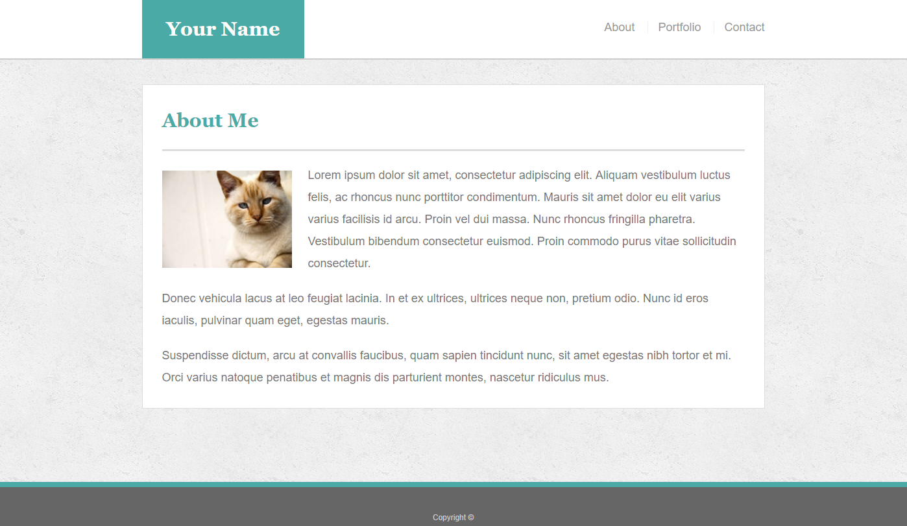
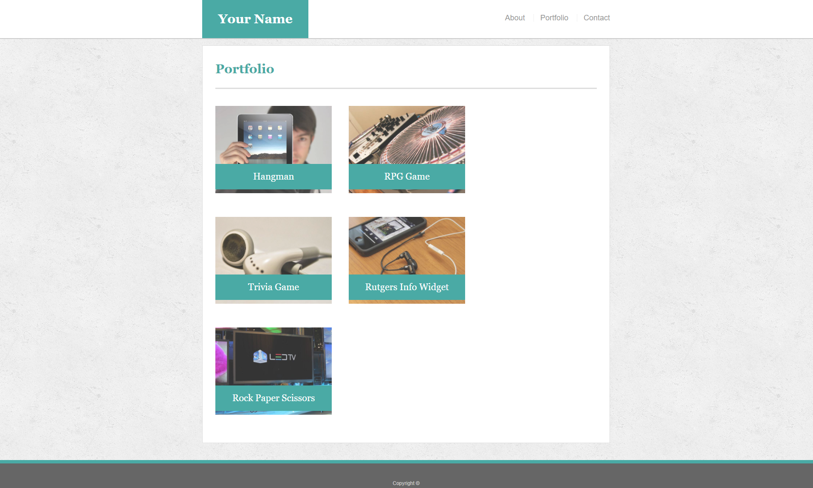

[Application](https://cragady.github.io/)

# Purpose

The purpose of this Portfolio was to make a copy of a basic portfolio using only html and css. This was the first portfolio template I made, however it was not the first html/css application I made. I have earlier works, but they're fairly rough.

# Guidelines

## About Me

## Contact

## Gallery 

## Recommended Dimensions

